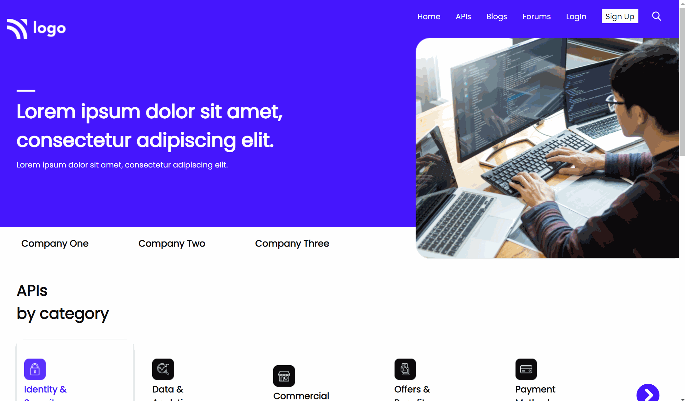

# Developer Landing Page

> ## [Prateek Budhiraja](https://prateekbudhiraja.in)

 

## More Info

## Tech Stack:

---

### Checkout the live website [here](dev-landing-gules.vercel.app/).

---

## My Learnings

- Learned about how to resize svg images with transform property.
- Box shadow.
- Hack to fix image inline to block to remove extra space in bottom.
- Outline: property for input.
- How to align button on top of input field.

---

## Images

